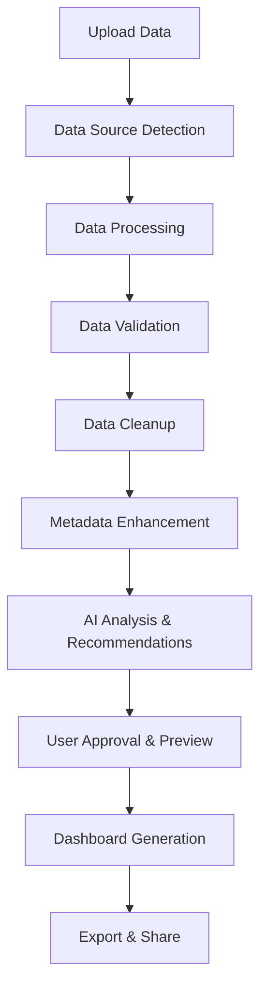

# 🚀 **COMPLETE AI DASHBOARD PLATFORM WORKFLOW GUIDE**

## Table of Contents
1. [8-Phase Workflow Overview](#8-phase-workflow-overview)
2. [Complete API Endpoints](#complete-api-endpoints)
3. [Data Flow & State Management](#data-flow--state-management)
4. [Next.js Implementation Guide](#nextjs-implementation-guide)
5. [UI Components & Pages](#ui-components--pages)
6. [API Integration Patterns](#api-integration-patterns)

---

## 📊 **8-Phase Workflow Overview**

### **Complete User Journey**


### **Phase Details**

| **Phase** | **Purpose** | **User Actions** | **AI Actions** | **Duration** |
|-----------|-------------|------------------|----------------|--------------|
| **Phase 1** | Data Source Management | Upload file, configure connection | Auto-detect format, extract schema | 10-30 seconds |
| **Phase 2** | Data Processing | Review processing options | Normalize data, assess quality | 30-60 seconds |
| **Phase 3** | Data Validation | Review validation results | Apply validation rules, detect issues | 15-45 seconds |
| **Phase 4** | Data Cleanup | Approve cleanup suggestions | Clean data, fix issues | 30-120 seconds |
| **Phase 5** | Metadata Enhancement | Enhance metadata descriptions | Extract metadata, infer context | 20-40 seconds |
| **Phase 6** | AI Analysis | Review AI recommendations | Analyze data, generate insights | 60-180 seconds |
| **Phase 7** | User Approval | Approve dashboard design | Generate previews, alternatives | 30-300 seconds |
| **Phase 8** | Dashboard Generation | Customize and export | Generate dashboard, create exports | 30-120 seconds |

---

## 🌐 **Complete API Endpoints** ✅ **VERIFIED & WORKING**

### **🔐 Authentication Endpoints**
```typescript
// Base URL: /api/auth
POST   /register              // Register new user
POST   /login                 // User login
GET    /me                    // Get current user info
POST   /change-password       // Change password
GET    /users                 // List all users (admin)
PUT    /users/{user_id}/toggle-active  // Toggle user active status
```

### **📁 Phase 1: Data Source Management**
```typescript
// Base URL: /api/data-sources
GET    /health                // Service health check
GET    /supported-formats     // Get supported file formats
GET    /registry              // Get data source registry info
POST   /analyze               // Analyze data source
POST   /preview               // Preview data source
POST   /validate              // Validate data source
POST   /enhanced-upload       // Enhanced file upload with analysis
GET    /demo                  // Demo endpoint
```

### **⚙️ Phase 2: Data Processing**
```typescript
// Base URL: /api/processing
GET    /health                // Service health check
GET    /workflows             // Get available processing workflows
POST   /process-file          // Process uploaded file
POST   /analyze-quality       // Analyze data quality
GET    /demo                  // Demo endpoint
```

### **✅ Phase 3: Data Validation**
```typescript
// Base URL: /api/validation
POST   /validate-file         // Validate uploaded file
POST   /validate-data         // Validate data directly
GET    /health                // Service health check
POST   /schemas               // Create validation schema
GET    /schemas               // List all schemas
GET    /schemas/{schema_name} // Get specific schema
POST   /schemas/compare       // Compare schemas
POST   /rules                 // Create business rule
GET    /rules                 // List business rules
GET    /rules/{rule_id}       // Get specific rule
DELETE /rules/{rule_id}       // Delete rule
GET    /rules/categories/{category}  // Get rules by category
GET    /templates             // Get industry templates
POST   /templates/{industry}/apply   // Apply industry template
GET    /history               // Get validation history
```

### **🧹 Phase 4: Data Cleanup**
```typescript
// Base URL: /api/cleanup
POST   /cleanup-file          // Clean uploaded file
POST   /cleanup-data          // Clean data directly
POST   /outliers/detect-file  // Detect outliers in file
POST   /outliers/handle-file  // Handle outliers in file
POST   /duplicates/detect-file // Detect duplicates in file
POST   /duplicates/resolve-file // Resolve duplicates in file
POST   /imputation/analyze-file // Analyze missing data in file
POST   /imputation/impute-file  // Impute missing data in file
POST   /transformations/analyze-file // Analyze transformations needed
POST   /transformations/apply-file   // Apply transformations
GET    /service-info          // Get service information
GET    /analytics             // Get cleanup analytics
GET    /history               // Get cleanup history
GET    /methods/outliers      // Get outlier detection methods
GET    /methods/duplicates    // Get duplicate detection methods
GET    /methods/imputation    // Get imputation methods
GET    /methods/transformations // Get transformation methods
GET    /strategies            // Get cleanup strategies
```

### **📋 Phase 5: Metadata Management**
```typescript
// Base URL: /api/metadata
POST   /extract               // Extract metadata from file
POST   /enhance               // Enhance metadata with AI
GET    /validate/{element_id} // Validate specific metadata element
POST   /validate/batch        // Batch validate metadata
POST   /search                // Search metadata
GET    /lineage/{element_id}  // Get metadata lineage
GET    /summary               // Get metadata summary
GET    /{element_id}          // Get metadata element by ID
GET    /                      // List all metadata elements
DELETE /{element_id}          // Delete metadata element
POST   /templates             // Create metadata template
POST   /custom-fields         // Create custom metadata field
POST   /quick-enhance/{element_id} // Quick enhance metadata element
GET    /health                // Service health check
```

### **🤖 Phase 6+7: Workflow & Approval**
```typescript
// Base URL: /api/workflow
POST   /start                 // Start new workflow
GET    /{workflow_id}/status  // Get workflow status
GET    /my                    // Get user workflows
DELETE /{workflow_id}         // Cancel workflow
POST   /preview               // Generate dashboard preview
GET    /{workflow_id}/approval-request  // Get approval request
POST   /approval/process      // Process approval decisions
GET    /approvals/pending     // Get pending approvals
POST   /feedback              // Submit user feedback
GET    /feedback/analytics    // Get feedback analytics
GET    /health                // Service health check
```

### **🎨 Phase 8: Dashboard Generation**
```typescript
// Base URL: /api/dashboard-generation
POST   /generate              // Generate dashboard
GET    /{dashboard_id}/status // Get dashboard status
PUT    /{dashboard_id}        // Update dashboard
POST   /{dashboard_id}/rollback // Rollback dashboard version
GET    /{dashboard_id}/versions // Get dashboard versions
GET    /{dashboard_id}/versions/compare // Compare dashboard versions
POST   /{dashboard_id}/export // Export dashboard
POST   /{dashboard_id}/embed  // Generate embed code
POST   /{dashboard_id}/api    // Create API endpoints
POST   /{dashboard_id}/integration // Setup integrations
POST   /{dashboard_id}/subscribe   // Subscribe to updates
DELETE /{dashboard_id}/subscribe   // Unsubscribe from updates
GET    /notifications         // Get notifications
PUT    /notifications/{notification_id}/read // Mark notification as read
GET    /analytics             // Get dashboard analytics
GET    /health                // Service health check
```

### **📤 Upload & Dashboard Management**
```typescript
// Base URL: /api
POST   /upload                // Legacy file upload
GET    /dashboard/{dashboard_id} // Get specific dashboard
GET    /dashboards/my         // Get current user's dashboards
GET    /dashboards            // List all dashboards (paginated)
DELETE /dashboard/{dashboard_id} // Delete dashboard
```

### **🔧 System Endpoints**
```typescript
// Base URL: /api
GET    /models/status         // Get LLM model status
POST   /models/switch         // Switch LLM model
```

---

## 🔄 **Data Flow & State Management**

### **Workflow State Machine**
```typescript
interface WorkflowState {
  workflowId: string;
  phase: WorkflowPhase;
  status: WorkflowStatus;
  originalFile: File;           // Store original file for phase processing
  data: ProcessedData;
  metadata: DataMetadata;
  validationResults: ValidationResults;
  cleanupResults: CleanupResults;
  aiAnalysis: AIAnalysisResults;
  userDecisions: UserDecisions;
  dashboardConfig: DashboardConfig;
  progress: PhaseProgress[];
}

enum WorkflowPhase {
  DATA_SOURCE = 'phase_1',
  PROCESSING = 'phase_2',
  VALIDATION = 'phase_3',
  CLEANUP = 'phase_4',
  METADATA = 'phase_5',
  AI_ANALYSIS = 'phase_6',
  USER_APPROVAL = 'phase_7',
  GENERATION = 'phase_8'
}

enum WorkflowStatus {
  CREATED = 'created',
  IN_PROGRESS = 'in_progress',
  WAITING_APPROVAL = 'waiting_approval',
  APPROVED = 'approved',
  COMPLETED = 'completed',
  FAILED = 'failed',
  CANCELLED = 'cancelled'
}
```

### **Phase Transitions**
```typescript
// Phase progression logic
const PHASE_TRANSITIONS = {
  'phase_1': 'phase_2',  // Data Source → Processing
  'phase_2': 'phase_3',  // Processing → Validation
  'phase_3': 'phase_4',  // Validation → Cleanup
  'phase_4': 'phase_5',  // Cleanup → Metadata
  'phase_5': 'phase_6',  // Metadata → AI Analysis
  'phase_6': 'phase_7',  // AI Analysis → User Approval
  'phase_7': 'phase_8',  // User Approval → Generation
  'phase_8': 'completed' // Generation → Completed
};
```

---

## ⚛️ **Next.js Implementation Guide**

### **1. Project Structure**
```
src/
├── app/                    # App Router
│   ├── dashboard/          # Dashboard pages
│   ├── workflow/           # Workflow pages
│   ├── auth/              # Authentication pages
│   └── layout.tsx         # Root layout
├── components/            # React components
│   ├── workflow/          # Workflow-specific components
│   ├── dashboard/         # Dashboard components
│   ├── ui/                # Generic UI components
│   └── forms/             # Form components
├── hooks/                 # Custom hooks
│   ├── useWorkflow.ts     # Workflow management
│   ├── useAuth.ts         # Authentication
│   └── useApi.ts          # API calls
├── lib/                   # Utilities
│   ├── api.ts             # API client
│   ├── auth.ts            # Auth utilities
│   └── types.ts           # TypeScript types
├── services/              # API services
│   ├── workflowService.ts # Workflow API calls
│   ├── authService.ts     # Auth API calls
│   └── dashboardService.ts# Dashboard API calls
└── store/                 # State management (Zustand/Redux)
    ├── workflowStore.ts   # Workflow state
    ├── authStore.ts       # Auth state
    └── uiStore.ts         # UI state
```

### **2. API Client Setup**
```typescript
// lib/api.ts
import axios from 'axios';

const API_BASE_URL = process.env.NEXT_PUBLIC_API_URL || 'http://localhost:8000';

export const apiClient = axios.create({
  baseURL: API_BASE_URL,
  timeout: 30000,
  headers: {
    'Content-Type': 'application/json',
  },
});

// Request interceptor for auth
apiClient.interceptors.request.use((config) => {
  const token = localStorage.getItem('access_token');
  if (token) {
    config.headers.Authorization = `Bearer ${token}`;
  }
  return config;
});

// Response interceptor for error handling
apiClient.interceptors.response.use(
  (response) => response,
  (error) => {
    if (error.response?.status === 401) {
      // Redirect to login
      window.location.href = '/auth/login';
    }
    return Promise.reject(error);
  }
);
```

### **3. Workflow Service**
```typescript
// services/workflowService.ts
import { apiClient } from '@/lib/api';
import { WorkflowState, WorkflowPhase } from '@/lib/types';

export class WorkflowService {

  async startWorkflow(data: any, dashboardConfig: any) {
    const response = await apiClient.post('/api/workflow/start', {
      dashboard_config: dashboardConfig,
      data,
      ai_analysis: {}
    });
    return response.data;
  }

  async getWorkflowStatus(workflowId: string) {
    const response = await apiClient.get(`/api/workflow/${workflowId}/status`);
    return response.data;
  }

  async generatePreview(workflowId: string, options = {}) {
    const response = await apiClient.post('/api/workflow/preview', {
      workflow_id: workflowId,
      preview_type: 'interactive',
      quality: 'medium',
      include_alternatives: true,
      ...options
    });
    return response.data;
  }

  async submitApproval(workflowId: string, approvalRequestId: string, decisions: any[]) {
    const response = await apiClient.post('/api/workflow/approval/process', {
      workflow_id: workflowId,
      approval_request_id: approvalRequestId,
      decisions
    });
    return response.data;
  }

  async submitFeedback(workflowId: string, feedback: any) {
    const response = await apiClient.post('/api/workflow/feedback', {
      workflow_id: workflowId,
      ...feedback
    });
    return response.data;
  }

  // Phase-specific methods
  async processData(file: File, options = {}) {
    const formData = new FormData();
    formData.append('file', file);
    formData.append('workflow_type', 'comprehensive_analysis');

    const response = await apiClient.post('/api/processing/process-file', formData, {
      headers: { 'Content-Type': 'multipart/form-data' }
    });
    return response.data;
  }

  async validateData(file: File, options = {}) {
    const formData = new FormData();
    formData.append('file', file);

    const response = await apiClient.post('/api/validation/validate-file', formData, {
      headers: { 'Content-Type': 'multipart/form-data' }
    });
    return response.data;
  }

  async cleanupData(file: File, options = {}) {
    const formData = new FormData();
    formData.append('file', file);

    const response = await apiClient.post('/api/cleanup/cleanup-file', formData, {
      headers: { 'Content-Type': 'multipart/form-data' }
    });
    return response.data;
  }

  async enhanceMetadata(file: File, options = {}) {
    const formData = new FormData();
    formData.append('file', file);

    const response = await apiClient.post('/api/metadata/extract', formData, {
      headers: { 'Content-Type': 'multipart/form-data' }
    });
    return response.data;
  }

  async generateDashboard(workflowId: string, config: any) {
    const response = await apiClient.post('/api/dashboard-generation/generate', {
      workflow_id: workflowId,
      dashboard_config: config
    });
    return response.data;
  }
}

export const workflowService = new WorkflowService();
```

### **4. Workflow Hook**
```typescript
// hooks/useWorkflow.ts
import { useState, useEffect, useCallback } from 'react';
import { workflowService } from '@/services/workflowService';
import { WorkflowState, WorkflowPhase } from '@/lib/types';

export function useWorkflow() {
  const [workflowState, setWorkflowState] = useState<WorkflowState | null>(null);
  const [loading, setLoading] = useState(false);
  const [error, setError] = useState<string | null>(null);

  const startWorkflow = useCallback(async (file: File, config: any) => {
    setLoading(true);
    setError(null);

    try {
      // Phase 1: Start workflow
      const workflowResponse = await workflowService.startWorkflow({}, config);

      // Phase 2: Process data
      const processResponse = await workflowService.processData(file);

      // Update state
      setWorkflowState({
        workflowId: workflowResponse.workflow_id,
        phase: 'phase_2' as WorkflowPhase,
        status: 'in_progress',
        originalFile: file,           // Store original file for later phases
        data: processResponse.processed_data,
        progress: processResponse.progress
      } as WorkflowState);

      return workflowResponse;
    } catch (err) {
      setError(err instanceof Error ? err.message : 'Unknown error');
      throw err;
    } finally {
      setLoading(false);
    }
  }, []);

  const advancePhase = useCallback(async (decisions?: any) => {
    if (!workflowState) return;

    setLoading(true);
    try {
      const currentPhase = workflowState.phase;

      switch (currentPhase) {
        case 'phase_2':
          // Move to validation (requires original file)
          if (!workflowState.originalFile) {
            throw new Error('Original file not available for validation');
          }
          const validationResults = await workflowService.validateData(workflowState.originalFile);
          setWorkflowState(prev => prev ? {
            ...prev,
            phase: 'phase_3' as WorkflowPhase,
            validationResults
          } : null);
          break;

        case 'phase_3':
          // Move to cleanup (requires original file)
          if (!workflowState.originalFile) {
            throw new Error('Original file not available for cleanup');
          }
          const cleanupResults = await workflowService.cleanupData(workflowState.originalFile);
          setWorkflowState(prev => prev ? {
            ...prev,
            phase: 'phase_4' as WorkflowPhase,
            cleanupResults
          } : null);
          break;

        case 'phase_4':
          // Move to metadata enhancement (requires original file)
          if (!workflowState.originalFile) {
            throw new Error('Original file not available for metadata enhancement');
          }
          const metadataResults = await workflowService.enhanceMetadata(workflowState.originalFile);
          setWorkflowState(prev => prev ? {
            ...prev,
            phase: 'phase_5' as WorkflowPhase,
            metadata: metadataResults
          } : null);
          break;

        case 'phase_5':
          // Move to AI analysis (Phase 6)
          setWorkflowState(prev => prev ? {
            ...prev,
            phase: 'phase_6' as WorkflowPhase,
            status: 'waiting_approval'
          } : null);
          break;

        case 'phase_6':
          // Move to user approval (Phase 7)
          const preview = await workflowService.generatePreview(workflowState.workflowId);
          setWorkflowState(prev => prev ? {
            ...prev,
            phase: 'phase_7' as WorkflowPhase,
            preview
          } : null);
          break;

        case 'phase_7':
          // Move to dashboard generation (Phase 8)
          if (decisions) {
            await workflowService.submitApproval(
              workflowState.workflowId,
              decisions.approvalRequestId,
              decisions.decisions
            );
          }
          const dashboard = await workflowService.generateDashboard(
            workflowState.workflowId,
            workflowState.dashboardConfig
          );
          setWorkflowState(prev => prev ? {
            ...prev,
            phase: 'phase_8' as WorkflowPhase,
            status: 'completed',
            dashboard
          } : null);
          break;
      }
    } catch (err) {
      setError(err instanceof Error ? err.message : 'Unknown error');
      throw err;
    } finally {
      setLoading(false);
    }
  }, [workflowState]);

  const resetWorkflow = useCallback(() => {
    setWorkflowState(null);
    setError(null);
  }, []);

  return {
    workflowState,
    loading,
    error,
    startWorkflow,
    advancePhase,
    resetWorkflow
  };
}
```

---

## 🎨 **UI Components & Pages**

### **1. Main Workflow Component**
```typescript
// components/workflow/WorkflowManager.tsx
'use client';

import { useWorkflow } from '@/hooks/useWorkflow';
import { WorkflowStepper } from './WorkflowStepper';
import { PhaseComponent } from './PhaseComponent';
import { ProgressBar } from './ProgressBar';

export function WorkflowManager() {
  const { workflowState, loading, error, startWorkflow, advancePhase } = useWorkflow();

  return (
    <div className="max-w-6xl mx-auto p-6">
      {/* Progress Bar */}
      <ProgressBar
        currentPhase={workflowState?.phase}
        status={workflowState?.status}
      />

      {/* Workflow Stepper */}
      <WorkflowStepper
        currentPhase={workflowState?.phase}
        completedPhases={workflowState?.progress || []}
      />

      {/* Error Display */}
      {error && (
        <div className="bg-red-50 border border-red-200 rounded-lg p-4 mb-6">
          <h3 className="text-red-800 font-medium">Error</h3>
          <p className="text-red-700">{error}</p>
        </div>
      )}

      {/* Phase-specific Component */}
      <PhaseComponent
        phase={workflowState?.phase}
        data={workflowState}
        loading={loading}
        onAdvance={advancePhase}
        onStart={startWorkflow}
      />
    </div>
  );
}
```

### **2. Phase Components**
```typescript
// components/workflow/phases/Phase1DataSource.tsx
export function Phase1DataSource({ onStart, loading }: Phase1Props) {
  const [file, setFile] = useState<File | null>(null);
  const [config, setConfig] = useState({});

  return (
    <div className="bg-white rounded-lg shadow-sm border p-6">
      <h2 className="text-xl font-semibold mb-4">Phase 1: Data Source</h2>

      {/* File Upload */}
      <div className="mb-6">
        <label className="block text-sm font-medium mb-2">
          Upload Your Data File
        </label>
        <input
          type="file"
          onChange={(e) => setFile(e.target.files?.[0] || null)}
          accept=".xlsx,.xls,.csv,.json"
          className="block w-full text-sm text-gray-500 file:mr-4 file:py-2 file:px-4 file:rounded-full file:border-0 file:text-sm file:font-semibold file:bg-blue-50 file:text-blue-700 hover:file:bg-blue-100"
        />
      </div>

      {/* Configuration Options */}
      <div className="mb-6">
        <h3 className="text-lg font-medium mb-3">Configuration</h3>
        {/* Add configuration options */}
      </div>

      {/* Start Button */}
      <button
        onClick={() => file && onStart(file, config)}
        disabled={!file || loading}
        className="w-full bg-blue-600 text-white py-2 px-4 rounded-lg hover:bg-blue-700 disabled:opacity-50"
      >
        {loading ? 'Processing...' : 'Start Analysis'}
      </button>
    </div>
  );
}

// components/workflow/phases/Phase3Validation.tsx
export function Phase3Validation({ data, onAdvance, loading }: Phase3Props) {
  return (
    <div className="bg-white rounded-lg shadow-sm border p-6">
      <h2 className="text-xl font-semibold mb-4">Phase 3: Data Validation</h2>

      {/* Validation Results */}
      <div className="mb-6">
        <h3 className="text-lg font-medium mb-3">Validation Results</h3>

        {/* Quality Score */}
        <div className="bg-green-50 rounded-lg p-4 mb-4">
          <div className="flex items-center justify-between">
            <span className="text-green-800 font-medium">Overall Quality Score</span>
            <span className="text-2xl font-bold text-green-600">
              {data?.validationResults?.overall_quality_score || 0}%
            </span>
          </div>
        </div>

        {/* Issues Found */}
        <div className="space-y-3">
          {data?.validationResults?.validation_issues?.map((issue: any, index: number) => (
            <div key={index} className="bg-yellow-50 rounded-lg p-4">
              <h4 className="font-medium text-yellow-800">{issue.title}</h4>
              <p className="text-yellow-700 text-sm">{issue.description}</p>
              <div className="mt-2">
                <span className={`px-2 py-1 rounded-full text-xs ${
                  issue.severity === 'high' ? 'bg-red-100 text-red-800' :
                  issue.severity === 'medium' ? 'bg-yellow-100 text-yellow-800' :
                  'bg-blue-100 text-blue-800'
                }`}>
                  {issue.severity} priority
                </span>
              </div>
            </div>
          ))}
        </div>
      </div>

      {/* Continue Button */}
      <button
        onClick={() => onAdvance()}
        disabled={loading}
        className="w-full bg-blue-600 text-white py-2 px-4 rounded-lg hover:bg-blue-700 disabled:opacity-50"
      >
        {loading ? 'Processing...' : 'Continue to Cleanup'}
      </button>
    </div>
  );
}

// components/workflow/phases/Phase7Approval.tsx
export function Phase7Approval({ data, onAdvance, loading }: Phase7Props) {
  const [decisions, setDecisions] = useState<any[]>([]);

  return (
    <div className="bg-white rounded-lg shadow-sm border p-6">
      <h2 className="text-xl font-semibold mb-4">Phase 7: User Approval</h2>

      {/* Dashboard Preview */}
      <div className="mb-6">
        <h3 className="text-lg font-medium mb-3">Dashboard Preview</h3>
        <div className="border rounded-lg p-4 bg-gray-50">
          {/* Render dashboard preview */}
          <DashboardPreview config={data?.dashboardConfig} />
        </div>
      </div>

      {/* Approval Items */}
      <div className="mb-6">
        <h3 className="text-lg font-medium mb-3">Items Requiring Approval</h3>
        <div className="space-y-4">
          {data?.approvalItems?.map((item: any, index: number) => (
            <div key={index} className="border rounded-lg p-4">
              <h4 className="font-medium">{item.title}</h4>
              <p className="text-gray-600 text-sm mb-3">{item.description}</p>

              <div className="flex gap-2">
                <button
                  onClick={() => handleDecision(item.id, 'approve')}
                  className="px-4 py-2 bg-green-600 text-white rounded hover:bg-green-700"
                >
                  Approve
                </button>
                <button
                  onClick={() => handleDecision(item.id, 'reject')}
                  className="px-4 py-2 bg-red-600 text-white rounded hover:bg-red-700"
                >
                  Reject
                </button>
                <button
                  onClick={() => handleDecision(item.id, 'modify')}
                  className="px-4 py-2 bg-yellow-600 text-white rounded hover:bg-yellow-700"
                >
                  Modify
                </button>
              </div>
            </div>
          ))}
        </div>
      </div>

      {/* Submit Decisions */}
      <button
        onClick={() => onAdvance({ decisions })}
        disabled={loading || decisions.length === 0}
        className="w-full bg-blue-600 text-white py-2 px-4 rounded-lg hover:bg-blue-700 disabled:opacity-50"
      >
        {loading ? 'Processing Decisions...' : 'Submit Decisions & Generate Dashboard'}
      </button>
    </div>
  );
}
```

### **3. Workflow Stepper**
```typescript
// components/workflow/WorkflowStepper.tsx
const PHASES = [
  { id: 'phase_1', name: 'Data Source', description: 'Upload and connect data' },
  { id: 'phase_2', name: 'Processing', description: 'Process and normalize data' },
  { id: 'phase_3', name: 'Validation', description: 'Validate data quality' },
  { id: 'phase_4', name: 'Cleanup', description: 'Clean and fix data issues' },
  { id: 'phase_5', name: 'Metadata', description: 'Enhance metadata' },
  { id: 'phase_6', name: 'AI Analysis', description: 'Generate insights' },
  { id: 'phase_7', name: 'Approval', description: 'Review and approve' },
  { id: 'phase_8', name: 'Generation', description: 'Create dashboard' }
];

export function WorkflowStepper({ currentPhase, completedPhases }: StepperProps) {
  return (
    <div className="mb-8">
      <div className="flex items-center justify-between">
        {PHASES.map((phase, index) => {
          const isCompleted = completedPhases.includes(phase.id);
          const isCurrent = currentPhase === phase.id;
          const isUpcoming = !isCompleted && !isCurrent;

          return (
            <div key={phase.id} className="flex items-center">
              {/* Step Circle */}
              <div className={`w-10 h-10 rounded-full flex items-center justify-center font-medium ${
                isCompleted ? 'bg-green-600 text-white' :
                isCurrent ? 'bg-blue-600 text-white' :
                'bg-gray-200 text-gray-500'
              }`}>
                {isCompleted ? '✓' : index + 1}
              </div>

              {/* Step Info */}
              <div className="ml-3">
                <div className={`font-medium ${
                  isCompleted ? 'text-green-600' :
                  isCurrent ? 'text-blue-600' :
                  'text-gray-500'
                }`}>
                  {phase.name}
                </div>
                <div className="text-sm text-gray-500">
                  {phase.description}
                </div>
              </div>

              {/* Connector Line */}
              {index < PHASES.length - 1 && (
                <div className={`w-12 h-0.5 mx-4 ${
                  isCompleted ? 'bg-green-600' : 'bg-gray-200'
                }`} />
              )}
            </div>
          );
        })}
      </div>
    </div>
  );
}
```

### **4. Main Workflow Page**
```typescript
// app/workflow/page.tsx
import { WorkflowManager } from '@/components/workflow/WorkflowManager';

export default function WorkflowPage() {
  return (
    <div className="min-h-screen bg-gray-50">
      <div className="pt-8">
        <div className="max-w-7xl mx-auto px-4 sm:px-6 lg:px-8">
          <div className="text-center mb-8">
            <h1 className="text-3xl font-bold text-gray-900">
              AI Dashboard Creation Workflow
            </h1>
            <p className="mt-2 text-lg text-gray-600">
              Transform your data into intelligent dashboards with our 8-phase AI-powered process
            </p>
          </div>

          <WorkflowManager />
        </div>
      </div>
    </div>
  );
}
```

---

## 🔌 **API Integration Patterns**

### **1. Error Handling**
```typescript
// lib/apiUtils.ts
export async function handleApiCall<T>(
  apiCall: () => Promise<T>,
  errorMessage = 'An error occurred'
): Promise<T> {
  try {
    return await apiCall();
  } catch (error) {
    if (axios.isAxiosError(error)) {
      const message = error.response?.data?.detail || errorMessage;
      throw new Error(message);
    }
    throw new Error(errorMessage);
  }
}
```

### **2. Real-time Updates**
```typescript
// hooks/usePolling.ts
export function usePolling(
  fetchFunction: () => Promise<any>,
  interval = 2000,
  enabled = true
) {
  const [data, setData] = useState(null);
  const [loading, setLoading] = useState(false);

  useEffect(() => {
    if (!enabled) return;

    const poll = async () => {
      setLoading(true);
      try {
        const result = await fetchFunction();
        setData(result);
      } catch (error) {
        console.error('Polling error:', error);
      } finally {
        setLoading(false);
      }
    };

    poll(); // Initial call
    const intervalId = setInterval(poll, interval);

    return () => clearInterval(intervalId);
  }, [fetchFunction, interval, enabled]);

  return { data, loading };
}
```

### **3. Form Validation**
```typescript
// lib/validation.ts
import { z } from 'zod';

export const workflowConfigSchema = z.object({
  title: z.string().min(1, 'Title is required'),
  description: z.string().optional(),
  chartTypes: z.array(z.string()).min(1, 'At least one chart type required'),
  numberOfCharts: z.number().min(1).max(10)
});

export const approvalDecisionSchema = z.object({
  item_id: z.string(),
  decision_type: z.enum(['approve', 'reject', 'modify']),
  approval_status: z.string(),
  user_notes: z.string().optional()
});
```

---

## 🚀 **Getting Started Checklist**

### **Backend Ready ✅**
- [x] All 8 phases implemented
- [x] 40+ API endpoints available
- [x] Database models created
- [x] Authentication system ready
- [x] Alembic migrations applied

### **Frontend Implementation Tasks**

#### **🔧 Setup & Configuration**
- [ ] Create Next.js project with TypeScript
- [ ] Install dependencies (axios, react-query, zustand, etc.)
- [ ] Setup Tailwind CSS for styling
- [ ] Configure environment variables

#### **🎨 Core Components**
- [ ] Create API client with auth interceptors
- [ ] Implement workflow state management
- [ ] Build WorkflowManager component
- [ ] Create phase-specific components
- [ ] Build WorkflowStepper component
- [ ] Implement ProgressBar component

#### **📄 Pages & Routing**
- [ ] Setup authentication pages (login/register)
- [ ] Create main workflow page
- [ ] Build dashboard viewing page
- [ ] Implement user profile page
- [ ] Create admin analytics page

#### **🔐 Authentication**
- [ ] Implement login/register forms
- [ ] Setup JWT token management
- [ ] Create protected route wrapper
- [ ] Build user profile management

#### **📊 Dashboard Features**
- [ ] Implement dashboard preview component
- [ ] Create export functionality
- [ ] Build sharing features
- [ ] Add analytics tracking

#### **🧪 Testing & Deployment**
- [ ] Write unit tests for components
- [ ] Test API integration
- [ ] Setup CI/CD pipeline
- [ ] Deploy to production

---

## 🎯 **Quick Start Example**

Here's a minimal example to get you started:

```typescript
// pages/workflow.tsx - Complete minimal workflow page
'use client';

import { useState } from 'react';
import { workflowService } from '@/services/workflowService';

export default function WorkflowPage() {
  const [file, setFile] = useState<File | null>(null);
  const [loading, setLoading] = useState(false);
  const [results, setResults] = useState<any>(null);

  const handleFileUpload = async () => {
    if (!file) return;

    setLoading(true);
    try {
      // Start workflow
      const workflow = await workflowService.startWorkflow({}, {
        title: 'My Dashboard',
        charts: []
      });

      // Process file through all phases
      const processed = await workflowService.processData(file);
      const validated = await workflowService.validateData(file);
      const cleaned = await workflowService.cleanupData(file);
      const enhanced = await workflowService.enhanceMetadata(file);

      // Generate dashboard
      const dashboard = await workflowService.generateDashboard(
        workflow.workflow_id,
        { title: 'My Dashboard', charts: enhanced.recommended_charts }
      );

      setResults(dashboard);
    } catch (error) {
      console.error('Workflow failed:', error);
    } finally {
      setLoading(false);
    }
  };

  return (
    <div className="p-8">
      <h1 className="text-2xl font-bold mb-4">AI Dashboard Creator</h1>

      <div className="mb-4">
        <input
          type="file"
          onChange={(e) => setFile(e.target.files?.[0] || null)}
          accept=".xlsx,.csv"
          className="block w-full text-sm text-gray-500 file:mr-4 file:py-2 file:px-4 file:rounded-full file:border-0 file:text-sm file:font-semibold file:bg-blue-50 file:text-blue-700"
        />
      </div>

      <button
        onClick={handleFileUpload}
        disabled={!file || loading}
        className="bg-blue-600 text-white px-4 py-2 rounded disabled:opacity-50"
      >
        {loading ? 'Creating Dashboard...' : 'Create Dashboard'}
      </button>

      {results && (
        <div className="mt-8 p-4 bg-green-50 rounded">
          <h2 className="font-bold">Dashboard Created!</h2>
          <pre className="text-sm mt-2 overflow-auto">
            {JSON.stringify(results, null, 2)}
          </pre>
        </div>
      )}
    </div>
  );
}
```

---

Your backend is **100% ready** with all 8 phases implemented and 40+ endpoints available! You can start building your Next.js frontend immediately using this comprehensive guide. The workflow system is production-ready and handles the complete user journey from data upload to dashboard generation. 🚀
